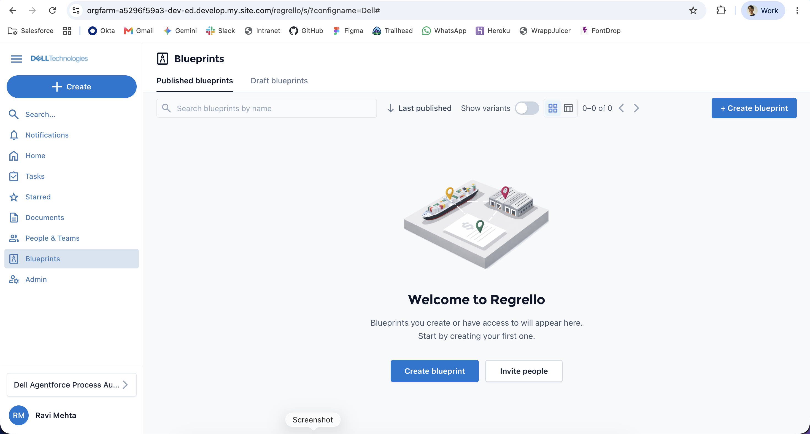
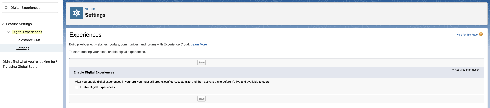
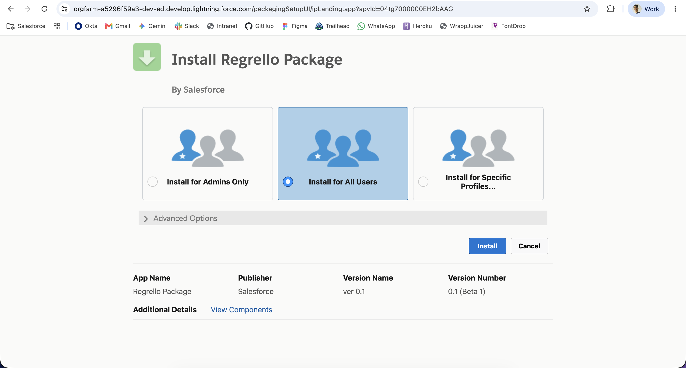
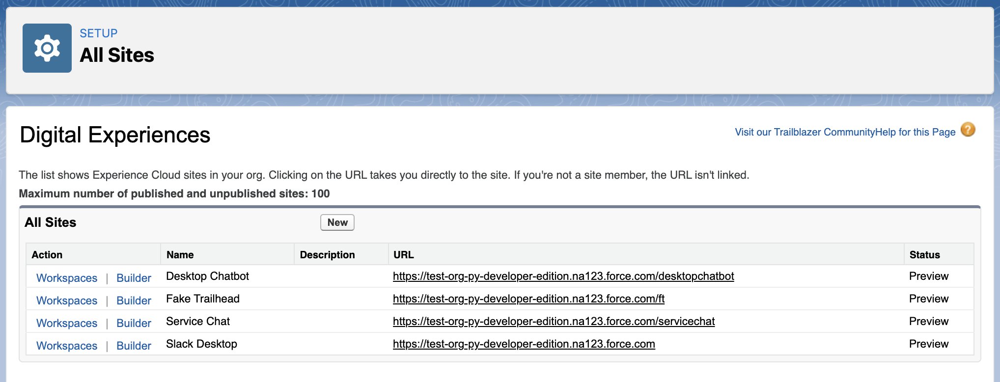
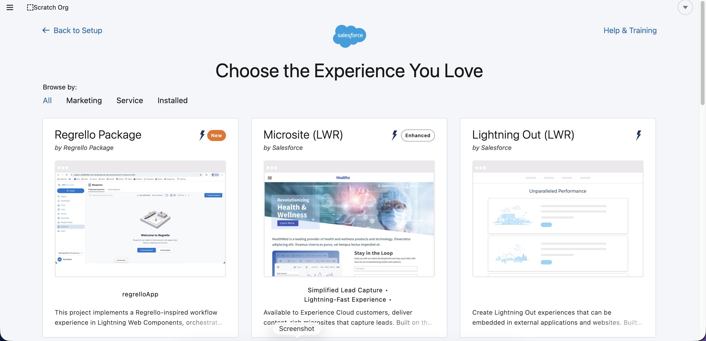
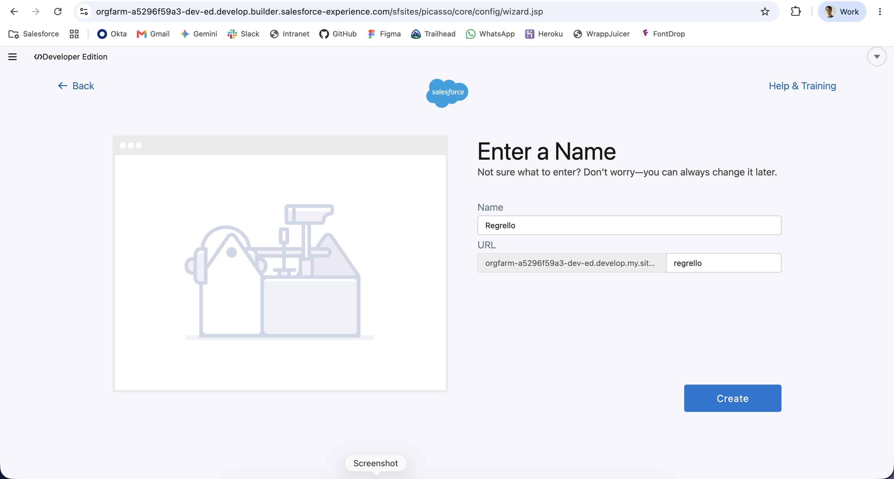
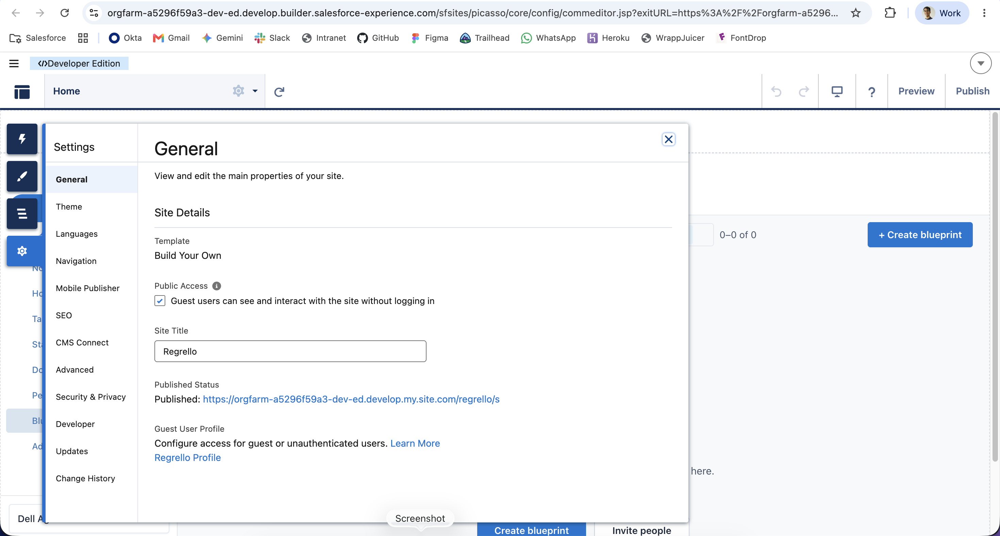

# Regrello Package

This project implements a Regrello-inspired workflow experience in Lightning Web Components, orchestrated by `regrelloApp`.

  

## Pre-Installation

Be sure to have Digital Experiences enabled:
* On *Setup* > Search "Digital Experiences" > "Settings" in the Quick Find
* Click on "Enable Digital Experiences", and "Save".

    

## Installation

Before the installation, make sure Communities are enabled in your org. Use the latest package version link and login with the target org credentials when requested. You will see the installation screen, select Install for All Users and press Install.

Package Installation link (version 1.54.0-2, created on Jul 3rd 2026): 

  <a>https://login.salesforce.com/packaging/installPackage.apexp?p0=04tg7000000ER3ZAAW</a>

  

>If you experience issues on installation it's recommended that you select the `Compile only the Apex in the package` option under `Advanced Options`, as shown above.

## Regrello Package Setup

### Setting up the Community

Once the installation is finished, go to All Sites > Digital Experiences and click on New.

  

Select the prebuilt Regrello Package template.

  

Click on Get Started. Fill the name input, complete the URL that will have your application and click on Create.

  

Once this is done, head to the Builder and before you publish the community site, be sure to make it Public by clicking on the checkbox with the label 'Guest users can see and interact with the site without logging in'.

  

Publish the Site.

## Main Workflow (`regrelloApp`)

`regrelloApp` is the parent controller for screen navigation and config propagation.

### Screen flow

1. **Blueprints screen** (`screen = "blueprints"`)
   - Displays the blueprints landing UI.
   - Can open the create modal.
2. **Generate screen** (`screen = "generate-upload"`)
   - Launches the generate-blueprint flow.
   - Emits `openblueprintdetail` when generation finishes.
3. **Blueprint detail screen** (`screen = "blueprint-detail"`)
   - Renders supplier blueprint timeline/details.

### Core events

- `blueprintsclick`: returns to blueprints list.
- `salesforceclick`: opens a predefined blueprint detail view.
- `chooseai`: transitions from create modal to generate flow.
- `openblueprintdetail`: opens detail view using generated blueprint name.

## Configuration Architecture (`regrelloConfigs`)

All configurable constants live in `force-app/main/default/lwc/regrelloConfigs/regrelloConfigs.js`.

`regrelloApp` reads URL parameter `configname` and passes `config-name` into child components.  
Example:

- `...?configname=Dell`

If `configname` is missing or unknown, config falls back to `Dell`.

### Current config domains

- `generateBlueprint`
  - `INDUSTRY_OPTIONS`
  - `BLUEPRINT_SECTION_TITLES`
  - `SECTION_ROWS`
  - `SECTION_HEADER_STARTS`
  - `FORM_STAGES`
  - `STEPS`
- `supplierBlueprint`
  - `BLUEPRINT_SECTION_TITLES`
  - `SECTION_ROWS`
  - `SECTION_START_MODE`
  - `STAGE_TABS`
  - `RIGHT_TABS`
  - `DAY_LABELS`
- `editModal.state`
  - Single object containing all modal local UI state defaults
- `sidebar.text`
  - Footer shortcut label
  - User avatar text
  - User name

### String reuse best practice

Section names are centralized through shared keys in `regrelloConfigs` to avoid repeated hardcoded strings across:

- `BLUEPRINT_SECTION_TITLES`
- `SECTION_ROWS`
- `SECTION_HEADER_STARTS`
- `SECTION_START_MODE`

## Main LWC Structure

- `regrelloApp`: parent state machine and routing logic.
- `regrelloSidebar`: left navigation and shortcut/user display.
- `regrelloGenerateBlueprint`: multi-step generation simulation.
- `regrelloSupplierBlueprint`: detail page with schedule/timeline.
- `regrelloBlueprintSection`: reusable section renderer and task edit launcher.
- `regrelloEditModal`: configurable task editor.
- `regrelloConfigs`: central config provider functions.

## Development Notes

- Keep UI text/constants in `regrelloConfigs` when they are meant to vary by tenant/customer.
- Prefer passing `config-name` from parents to children for deterministic config resolution.
- For new config variants, add a new top-level key in `CONFIGS` and reuse existing schema.

## Salesforce DX References

- [Salesforce Extensions Documentation](https://developer.salesforce.com/tools/vscode/)
- [Salesforce CLI Setup Guide](https://developer.salesforce.com/docs/atlas.en-us.sfdx_setup.meta/sfdx_setup/sfdx_setup_intro.htm)
- [Salesforce DX Developer Guide](https://developer.salesforce.com/docs/atlas.en-us.sfdx_dev.meta/sfdx_dev/sfdx_dev_intro.htm)
- [Salesforce CLI Command Reference](https://developer.salesforce.com/docs/atlas.en-us.sfdx_cli_reference.meta/sfdx_cli_reference/cli_reference.htm)
